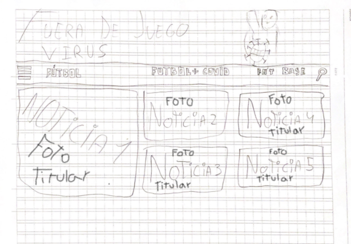
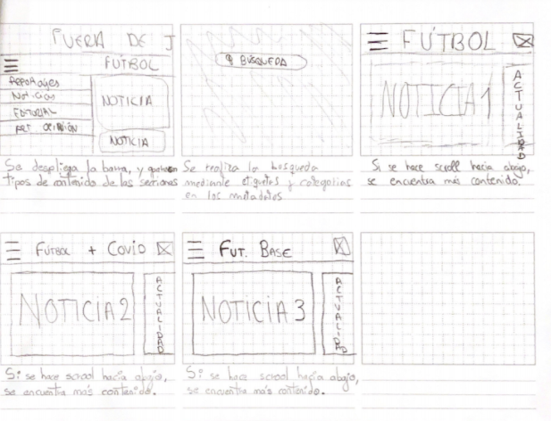

# Wireframes

<!--
Recoged en este documento un listado con enlaces a los diferentes
wireframes que creéis para el proyecto web
-->

Sobre la portada, incluiremos, además del titular, la foto correspondiente a la noticia. A primera vista, no se podra apreciar el subtitulo, el cuerpo, la fecha y el autor, ya que se encuentran dentro de la misma noticia.

En los apartados "Fútbol", "Fútbol base" y "Fútbol+COVID" se llevara a cabo la misma estructura de los elementos de la página. A primera vista se visualiza la foto, el titular y una columna lateral de "Actualidad" donde apareceran las noticias de Ultima Hora. Dentro de cada noticia de la sección, aparecera el titular, subtitulo, cuerpo de la noticia, autor y fecha.
